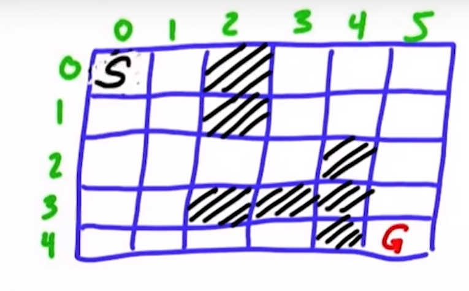

# Motion Planning:  
Robot is in a world and has to reach a goal position - The robot has to plan a path to navigate to this goal! This process of finding a path from the start location to the goal location is called "Planning"        
### Compute Cost:         
We find the "Optimal" path by computing the total cost that is required in different possible paths and choosing the Least Cost Path. (This doesn't take into account any unexpected obstacles). For example, we can assign costs to each action taken by a robot - A forward movement can be given a cost of 1 unit, whereas turns (right/left) could be given costs as required and then an optimal path could be obtained.          
Let us consider an example discrete world as shown below:     
       
**S** is the start position and **G** is the Goal position. The robot can move Up/Down/Left/Right. Now we start expanding out into the adjacent grid cells ([0,0] to [1,0] & [0,1]). **g-value** is defined as the number of expands required to get to a cell. The g-value for each of the cells we expanded to from [0,0] is 1. We further expandmthis way, trying to keep the g-value to a minimum and eventually hit the goal state. The g-value when the goal state is reached is the length of the path/number of steps to the goal.
Checkout [Expansion Grid](https://classroom.udacity.com/courses/cs373/lessons/48646841/concepts/c1705d77-0b01-44b4-bacc-efbcdc32e5b5)
### A*
